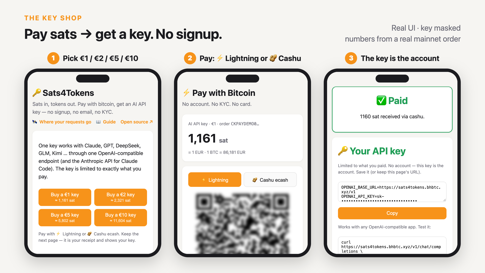

<h1>
  <picture>
    <source media="(prefers-color-scheme: dark)" srcset="docs/images/logo-dark-mode.png">
    
  </picture>
</h1>

**Pay sats, get an AI API key.** Customers pay with **Lightning** or **Cashu ecash** — no account, no
KYC, no card — and the key is capped at exactly what they paid. Every payment is credited **exactly
once**, even if the gateway is killed mid-payment.

Built at [bitcoin++ Berlin 2026](https://btcpp.dev) (payments edition) for a real shop: our AI API relay
(310 users, ~12 billion tokens a month), which runs [new-api](https://github.com/QuantumNous/new-api).

**Live demo (mainnet, real sats):** <https://sats4tokens.bhbtc.xyz/>

**Slides:** [docs/slides.pdf](docs/slides.pdf)

**Docs:** [user guide](docs/user-guide.md) · [self-hosting](docs/self-hosting.md) · [HTTP API](docs/api.md) · [how it works](docs/how-it-works.md)



> **Real money, verified.** 2026-10-02, mainnet (Coinos mint), paid from a phone wallet:
> - **Key shop:** $1 (1161 sat) → API key → a real model call.
> - **Top-up:** $1 (1158 sat) → credited to a relay account → withdrawn from the gateway as one Cashu
>   token → received back in a phone wallet.
>
> No Lightning node on our side at any point.

## Why

An AI API relay pools accounts at OpenAI / Anthropic / Google upstream and resells access downstream
through one OpenAI-compatible endpoint. The AI companies see the relay, not the user — so a relay is
already a privacy layer. Payment breaks it: relays in China take Alipay / WeChat Pay, both need a
real-name account, and every API call ends up tied to an ID card.

## Key shop: pay, get a key

Open `/`, pick $1 / $2 / $5 / $10, pay with ⚡ or 🥜, and the checkout page shows an API key **with its
endpoint**, capped at exactly what you paid. No signup, no email, no password — **the key is the account**.

- The key is a new-api token of one pool user, with its own hard quota (`$1` → `$1` of quota).
  The gateway holds only that user's personal access token, not an admin key.
- Exactly once: the token name comes from the order id; the gateway looks it up before creating, so a
  crash between "created" and "saved" finds the same key instead of making a second one.
- The order id is 128 random bits and is the receipt: whoever has the `/pay/…` link can see the key —
  and its usage: balance left and the latest calls (time, model, tokens, cost), straight from new-api.
- Both pages list every model the key can call with its price (USD per 1M tokens, from new-api's pricing).
- **Claude Code works too**: the key page has a copy-paste command that points Claude Code at the relay
  (`ANTHROPIC_BASE_URL` + `ANTHROPIC_AUTH_TOKEN`). It caps the output tokens because new-api reserves quota for
  `max_tokens` up front, and Claude Code's default would need more than a $1 key holds.

Users who already have a relay account can also **top up** through the same checkout (see *Top-ups* below).

## How it works

```
 customer                       gateway                                   Cashu mint
    │  buy a $1 key  ──────►  order, BTC price locked
    │ ◄───────────────────── /pay/:id checkout page
    │                            │
    │  ⚡ pay invoice ───────────┼──── mint quote (bolt11) ─────────────►  receives the sats
    │  🥜 or paste token ────────┼──── swap (NUT-03) ───────────────────►  blind-signs new proofs
    │                            │ ◄── "quote PAID" push (NUT-17) ───────
    │                            │ ──► mint proofs to our seed (NUT-04/13)
    │                            │ ──► new-api: create the capped key (find-or-create)
    │  🔑 key + endpoint  ◄──────┤
                operator: one click → whole balance as one Cashu token
```

- **The mint is our Lightning node.** For ⚡ the gateway asks the mint for an invoice; when it's paid
  the mint signs ecash for us. For 🥜 the customer pastes a token and we swap it for proofs of our own.
- **Private.** The mint signs blinded messages; it can't link the payer to the shop.
- **Price.** Fiat → BTC is locked when the order is created (CoinGecko → Coinbase → mempool.space
  fallback, a ≤10-min-old price if all three are down). Sats are rounded up.

## Exactly once: write first, then ask the mint

The dangerous moment: the mint signs our outputs, and the gateway dies **before** saving them. The money
exists, but nobody holds it — or worse, a naive retry credits the order twice.

1. Every output comes from a seed and a counter (**NUT-13**), so it is deterministic.
2. Before **every** mint call, the gateway writes the counter range it will use into the order and saves
   the ledger (write-ahead). Only then does it call the mint.
3. After a crash, the order is in `SETTLING`. The gateway asks the mint "did you sign these exact
   outputs?" (**NUT-09 restore**) and follows one table:

| # | facts | action |
|---|---|---|
| 1 | restore finds our outputs | **finish** — the mint signed, we only lost the reply |
| 2 | lightning, quote PAID | **retry** with the same counter → identical outputs, signable only once |
| 3 | lightning, quote ISSUED / UNPAID | **conflict** → a human looks |
| 4 | cashu, customer's proofs UNSPENT | **retry** |
| 5 | cashu, proofs PENDING | **wait** |
| 6 | cashu, proofs SPENT | **abort** (the token was spent elsewhere) |

`npm run crash-demo` kills the gateway with `kill -9` at both crash points, for both payment paths.
All four cases end the same way: credited once, replaying the token is rejected.

Crediting is idempotent too: a key is find-or-create by order id, and a top-up is retried with backoff
until new-api confirms it, which credits each order once on its side.

## Polite to public mints

Public mints rate-limit and firewall IPs that poll hard. (We learned this during the hackathon: one mint refused
our server after hours of polling 4 quotes every 2 s; another answered `429` at ~24 quote checks/min.)

- **NUT-17 push** is the primary signal: one WebSocket, the mint pushes "quote PAID", then a single
  HTTP check confirms it and we mint.
- HTTP polling is only a safety net with a hard budget: ≤ 1 quote check per 8 s across all orders,
  60 s per order while subscribed, open checkout pages first, and backoff (5 s → 60 s) on network errors or `429`.
- On startup the gateway refuses any mint without NUT-04 (bolt11, sat), NUT-07 and NUT-09.

## Cashu NUTs used

NUT-03 swap · NUT-04 mint from Lightning · NUT-06 mint info check · NUT-07 proof states ·
NUT-09 restore · NUT-13 deterministic secrets · NUT-17 WebSocket subscriptions

## Run it

Node ≥ 22 (runs TypeScript directly, no build step).

```sh
npm install
EPAY_KEY=demo-key PORT=8091 npm run gateway                          # testnut by default
EPAY_KEY=demo-key GATEWAY=http://127.0.0.1:8091 npm run cli balance  # or: withdraw
```

| env | meaning |
|---|---|
| `NEWAPI_URL`, `NEWAPI_USER_ID`, `NEWAPI_TOKEN`, `KEY_BASE_URL` | turn on the key shop: new-api URL, pool user id + its personal access token, endpoint shown with the key (default new-api's ServerAddress + `/v1`). Needs `FIAT=usd` |
| `MINT_URL` | Cashu mint (default `https://testnut.cashu.space`) |
| `FIAT`, `BTC_PRICE` | order currency (default `cny`; `usd` for the key shop); fixed price for offline demos |
| `ADMIN_KEY` | operator page key |
| `EPAY_KEY` (required), `EPAY_PID` | signing key / merchant id shared with new-api for top-ups (see below). Keep `ADMIN_KEY` different: this one can sign "paid" callbacks |
| `DATA_DIR`, `ORDER_TTL_MIN`, `CHECKOUT_TAB=ln\|cashu`, `WITHDRAW_TOKEN_OVER_HTTP=1` | storage, order lifetime, default tab, show withdrawn token on the page (https only) |

**Operator** — `/admin.html#key=ADMIN_KEY`: balance, orders, one-click withdraw of the whole balance as
one Cashu token (always written to `DATA_DIR/withdrawals/` before the proofs leave the ledger).

### Top-ups

The gateway also plugs into new-api's built-in online-payment settings, so existing users get a Bitcoin
button on the top-up page. In new-api → 支付设置: `PayAddress` = gateway URL, `EpayId` = `EPAY_PID`,
`EpayKey` = `EPAY_KEY`, `PayMethods` = `[{"name":"Bitcoin","color":"#f7931a","type":"bitcoin"}]`.
new-api redirects the customer to `/submit.php` with a signed form; after payment the gateway sends a
signed callback, retried until new-api confirms. `scripts/fake-merchant.ts` stands in for new-api locally.

## Tests

```sh
npm test && npm run typecheck      # 18 unit tests, offline: signatures, idempotent orders, write-ahead, decideSettle, retry backoff, mint checks
npm run edge-checks                # 15 end-to-end checks against testnut (~40 s): bad signatures, underpaid / spent tokens, callback retries, withdraw
npm run crash-demo -- lightning after-mint   # or: cashu | after-writeahead
```

## Layout

```
src/server.ts    HTTP: key shop (/ , /api/buy), checkout, order API, top-up form (/submit.php), operator API, callback loop
src/keyshop.ts   paid key order → capped new-api token (find-or-create by name), usage
src/gateway.ts   the engine: seed-backed cashu-ts wallet, write-ahead settle, NUT-09 recovery, NUT-17 push
src/ledger.ts    orders, durable JSON ledger, pure decision logic (no network)
src/epay.ts      MD5 sign / verify for the top-up form and callback
src/price.ts     fiat → BTC with fallbacks
web/             key shop, mobile checkout page, operator page
deploy/demo/     the live demo stack (a private copy of the relay, isolated from production)
docs/            user guide, self-hosting, HTTP API, internals; slides (PDF) and screenshots (mock orders)
```

About 1,750 lines for the gateway and pages, 600 for tests and scripts. Dependencies: `@cashu/cashu-ts`, `qrcode`.

## Limits and next steps

- **One mint per gateway.** A token from another mint is rejected with a clear message (pay with ⚡ instead).
  Next: a list of trusted mints, or melting foreign tokens to pay our invoice.
- **Overpayment is kept** (a pasted token can't be split here; the page shows the exact amount).
- **The mint is custodial** until you withdraw — so withdraw often, or run your own mint.
- Next: topping up an existing key, NUT-18 payment requests (scan instead of paste), automatic melt to the
  operator's Lightning wallet, pay-per-request with Cashu tokens in the API header.

## Safety

`data/` holds the wallet seed and ecash proofs — **bearer money**. It is git-ignored; back up `seed.hex`.
